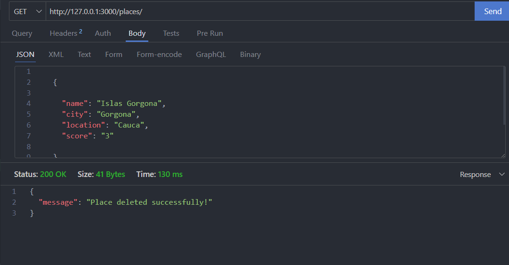

# Tourist attractions API REST

Api basada en la arquitectura REST, la cual permite listar los top lugares turísticos de Colombia.

# Tecnologías usadas

- Node js versión 16.17.1
- Express js versión 4.18.2
- MongoDB versión 5.0.14
- IDE (Visual studio code)
- GIT versión 2.37.2.windows.2

# Instalación

1. Clona este repositorio: `https://github.com/AndresSilverall/top-tourist-attractions-in-colombia-api.git`
2. Navega a la carpeta del proyecto: `cd top-tourist-attractions-in-colombia-api`
3. Instalar todas las depedencias con: `npm install`
5. Iniciar servidor con `npm start`

# Métodos establecidos para la API

<table style="border-collapse: collapse; width: 100%;">
    <tr>
      <td style="border: 1px solid black;">Método</td>
      <td style="border: 1px solid black;">Endpoint</td>
      <td style="border: 1px solid black;">Descripción </td>
    </tr>
    <tr>
      <td style="border: 1px solid black;"><code>GET</code></td>
      <td style="border: 1px solid black;"><code>/places/</code></td>
      <td style="border: 1px solid black;">Obtener todos los lugares turísticos almacenados en la BD.</td>
    </tr>
    <tr>
      <td style="border: 1px solid black;"><code>POST</code></td>
      <td style="border: 1px solid black;"><code>/places/:id</code></td>
      <td style="border: 1px solid black;">Obtener detalles de un lugar turístico.</td>
    </tr>
    <tr>
      <td style="border: 1px solid black;"><code>PUT</code></td>
      <td style="border: 1px solid black;"><code>/places/:id</code></td>
      <td style="border: 1px solid black;">Actualizar un lugar turístico a través de su ID.</td>
    </tr>
    <tr>
      <td style="border: 1px solid black;"><code>DELETE</code></td>
      <td style="border: 1px solid black;"><code>/places/:id</code></td>
      <td style="border: 1px solid black;">Eliminar un lugar turístico a través de su ID.</td>
    </tr>
    <tr>
</table>

# Demo de API

#### Obtener todos los lugares turísticos

#### Obtener un lugar turístico en especifico a través de su ID

#### Almacenar un lugar turístico en la Base de datos

#### Actualizar un lugar turístico 

#### Eliminar un lugar turístico a través de su ID

